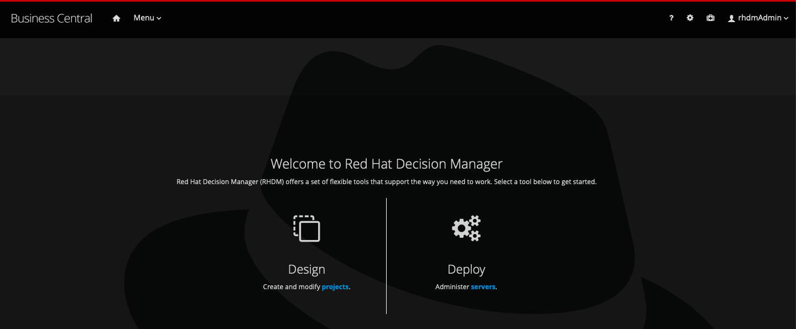
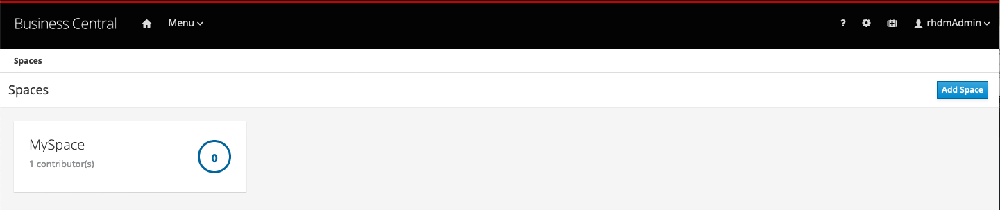
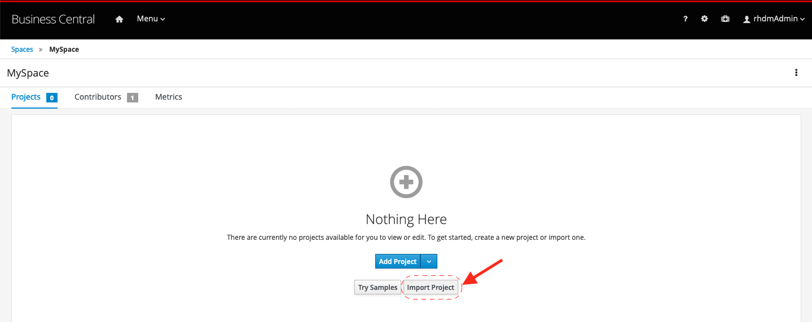
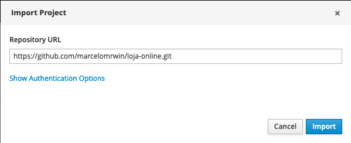
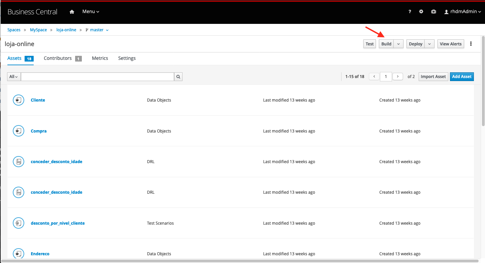
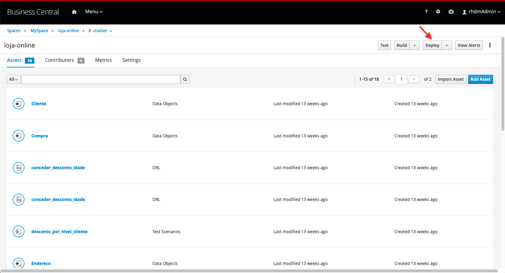
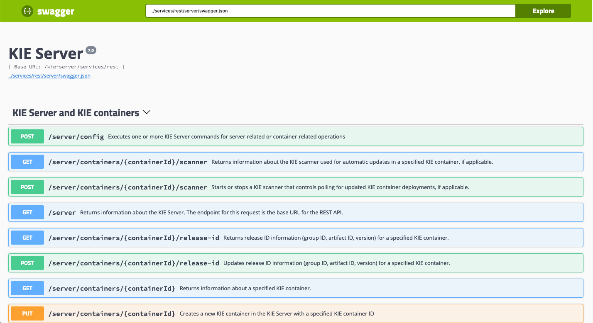

Loja Online
=======================

Projeto demonstrando o uso do Red Hat Decision Manager 7

### Para reproduzir a demo siga os seguintes passos:
1. Realize a instalação do RHDM 7.5 seguindo o tutorial [Red Hat](https://access.redhat.com/documentation/en-us/red_hat_decision_manager/7.5/html/installing_and_configuring_red_hat_decision_manager_on_red_hat_jboss_eap_7.2/index) ou [Red Hat Developers](https://developers.redhat.com/products/red-hat-decision-manager/docs-and-apis).
1. Inicie o servidor com o DM 7.5.
1. Após realizar o login o DM apresentará a tela inicial

1. Clique em **Design**

1. Clique no Space **MySpace**

1. Clique em **Import Project**
1. Informe no campo _Repository URL_ o valor **https://github.com/marcelomrwin/loja-online.git** 

1. Em seguida clique em **Import**

1. Selecione o projeto _loja-online_ e em seguida clique em **OK** para importar o projeto

1. Clique em **Build**

1. Clique em **Deploy**

1. Acesse a API swagger através da [http://localhost:8080/kie-server/docs](http://localhost:8080/kie-server/docs/)

Github do projeto de backend que consome as regras [https://github.com/marcelomrwin/loja-online-backend](https://github.com/marcelomrwin/loja-online-backend)

O projeto com as regras está em operação e pronto para receber requisições.
