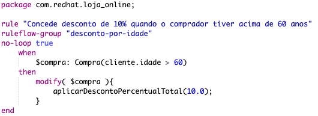
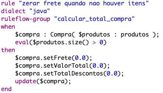
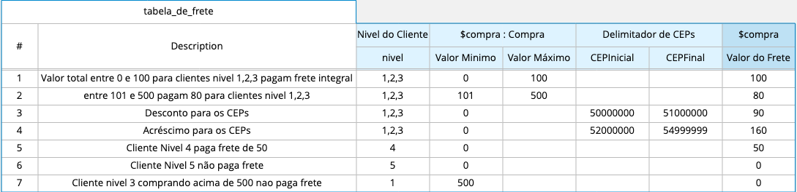
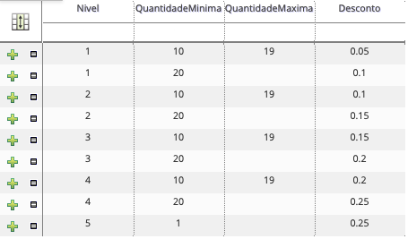

Loja Online
=======================

Projeto demonstrando o uso do Red Hat Decision Manager 7

### Para reproduzir a demo siga os seguintes passos:
1. Realize a instalação do RHDM 7.4.1 seguindo o tutorial [Red Hat](https://access.redhat.com/documentation/en-us/red_hat_decision_manager/7.5/html/installing_and_configuring_red_hat_decision_manager_on_red_hat_jboss_eap_7.2/index) ou [Red Hat Developers](https://developers.redhat.com/products/red-hat-decision-manager/docs-and-apis).
1. Inicie o servidor com o DM 7.4.1
1. Após realizar o login o DM apresentará a tela inicial

1. Clique em **Design**

1. Clique no Space **MySpace**

1. Clique em **Import Project**
1. Informe no campo _Repository URL_ o valor **https://github.com/marcelomrwin/loja-online.git** 

1. Em seguida clique em **Import**

1. Selecione o projeto _loja-online_ e em seguida clique em **OK** para importar o projeto

1. Clique em **Build**

1. Clique em **Deploy**

1. Acesse a API swagger através da [http://localhost:8080/kie-server/docs](http://localhost:8080/kie-server/docs/)

Github do projeto de backend que consome as regras [https://github.com/marcelomrwin/loja-online-backend](https://github.com/marcelomrwin/loja-online-backend)

O projeto com as regras está em operação e pronto para receber requisições.

#### As seguintes regras estão implementadas por padrão:
---

* Clientes com idade acima de 60 anos recebem desconto de 10%
---

* Zerar o frete quando não houver itens de compra selecionados
---

* Para clientes de nível 1,2 e 3 com compra no valor entre 0,00 e 100,00 pagam 100,00 de frete.
* Para clientes de nível 1,2 e 3 com compra no valor entre 101,00 e 500,00 o valor do frete será 80,00.
* Para clientes de nível 1,2 e 3 que residirem do cep 50000000 até 51000000 o valor do frete será 90.
* Para clientes de nível 1,2 e 3 que residirem do cep 52000000 até 54999999 o valor do frete será 160.
* Clientes de nível 4 pagam frete de 50,00
* Clientes de nível 5 não pagam frete
* Clientes de nível 3 comprando acima de 500,00 não pagam frete
---

* Clientes de nível 1 comprando entre 10 e 19 itens recebem desconto de 5%
* Clientes de nível 1 comprando a partir de 20 itens recebem desconto de 10%
* Clientes de nível 2 comprando entre 10 e 19 itens recebem desconto de 10%
* Clientes de nível 2 comprando a partir de 20 itens recebem desconto de 15%
* Clientes de nível 3 comprando entre 10 e 19 itens recebem desconto de 15%
* Clientes de nível 3 comprando a partir de 20 itens recebem desconto de 20%
* Clientes de nível 4 comprando entre 10 e 19 itens recebem desconto de 20%
* Clientes de nível 4 comprando a partir de 20 itens recebem desconto de 25%
* Clientes de nível 5 comprando a partir de 1 item recebem desconto de 25%
---
